# Aria Migration SaaS User Guide

Generated: 15/05/2026

> AI-assisted output. Registered migration agent review required before use. Aria does not provide final migration advice, does not guarantee visa outcomes, and does not lodge applications.

> Screenshot note: screenshots were captured from localhost with dummy guide data only. The guide does not include real client data, secrets, raw tokens, token hashes, or raw document URLs.

## Table Of Contents

1. Introduction
2. Account Creation And Sign In
3. Owner Dashboard
4. Company And Workspace Settings
5. Team And Agent Management
6. Clients
7. Matters
8. Documents
9. Extracted Evidence Review
10. AI Draft Autofill
11. Application Drafts
12. Subclass Support
13. Client Confirmations And Portal
14. Appointments
15. Official Forms And Company PDF Templates
16. Generated Documents And Draft Packs
17. Invoices
18. Ask Aria Assistant
19. Visa Knowledge And Migration Updates
20. Security, Audit, Data Export, And Incidents
21. Light And Dark Mode
22. Common Workflow
23. Troubleshooting
24. Safety And Legal Reminders

## 1. Introduction

Aria Migration is a migration-practice SaaS for workspace owners, company admins, migration agents, staff, clients, and privacy-safe platform operators.

Aria helps organise clients, matters, documents, evidence extraction, application draft fields, subclass readiness, client confirmations, appointments, generated draft packs, firm PDF templates, updates, audit logs, launch controls, and AI-assisted practice support.

Think of Aria as an evidence-backed preparation workspace. It helps a migration practice assemble the file, surface missing evidence, prepare draft field values, request client confirmations, and create draft packs for review.

Aria is not intended to be the final decision-maker. The registered migration agent remains responsible for checking evidence, assessing legal strategy, confirming declarations, approving documents, and deciding what is suitable to use.

Aria does not replace a registered migration agent, does not provide final legal advice, does not guarantee visa outcomes, and does not lodge applications automatically.

AI-assisted output. Registered migration agent review required before use. Aria does not provide final migration advice, does not guarantee visa outcomes, and does not lodge applications.

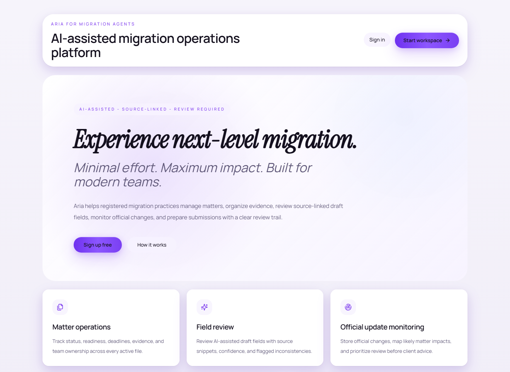

Caption: Introduction screen captured from localhost with dummy/local-safe context.

## 2. Account Creation And Sign In

Workspace owners use the public sign-up/sign-in flow when public signup is enabled by the operator. Staff and agents normally enter through the workspace staff portal or an invite link.

Public signup may be disabled in production until launch controls are approved. That is expected and should be treated as an operational safety setting, not a broken page.

The first owner account controls the workspace setup. Staff and agent users should be invited into the workspace rather than creating separate unrelated company accounts.

If an agent sees a message telling them to use the workspace portal, that means their account is staff-scoped and should sign in through /w/[workspaceSlug]/login.

1. Open /auth/sign-up to create an owner workspace when public signup is enabled.
2. Open /auth/sign-in to sign in as a workspace owner.
3. Open /w/[workspaceSlug]/login for staff and agent login.
4. Use invite links to activate staff accounts and set a password.
5. If login fails, check whether the account is an owner account, an invited staff account, a deactivated user, or a user whose invite/password setup is incomplete.

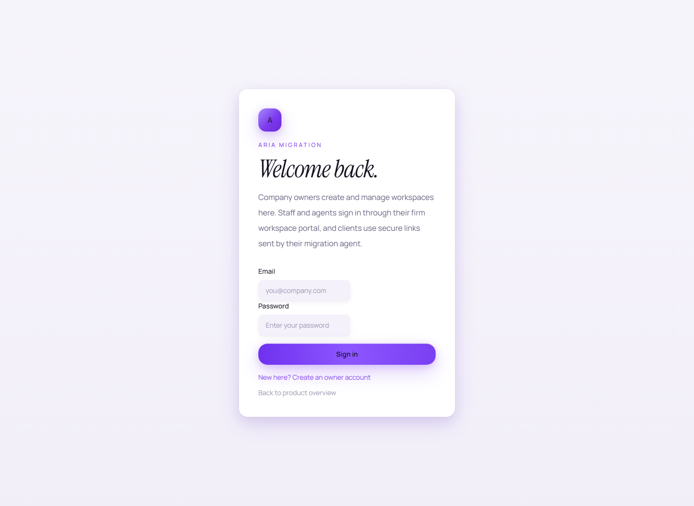

Caption: Account Creation And Sign In screen captured from localhost with dummy/local-safe context.

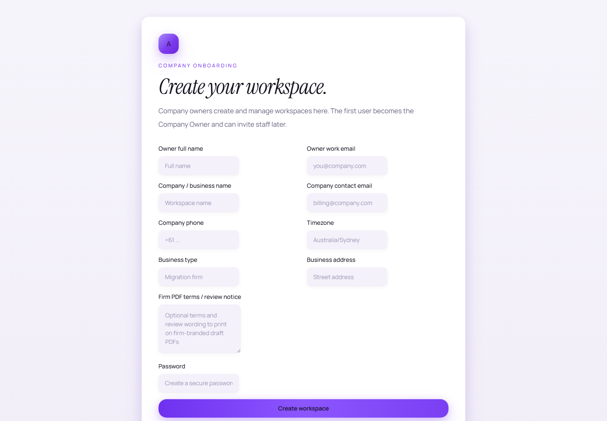

Caption: Account Creation And Sign In screen captured from localhost with dummy/local-safe context.

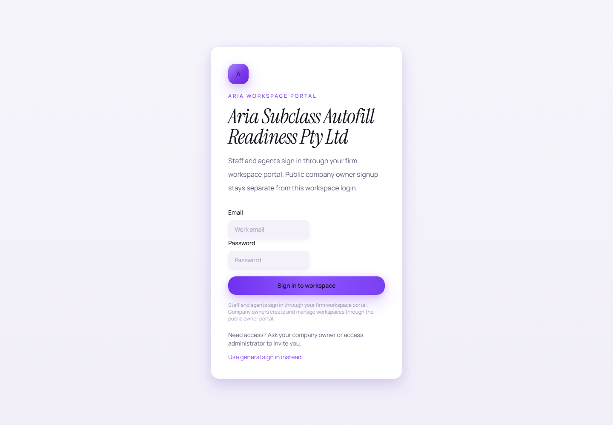

Caption: Account Creation And Sign In screen captured from localhost with dummy/local-safe context.

## 3. Owner Dashboard

The owner dashboard lives at /app/overview. It gives the owner a workspace-wide overview of caseload, recent work, AI and evidence status, and fast actions.

Owners can see workspace-wide data according to their role. Agents and staff remain scoped by role and assignment.

The daily briefing highlights priority actions, blocked matters, follow-up queues, review-required evidence, and the standing review warning.

Use the dashboard as a triage screen. It is designed to answer: what needs review, what is blocked, which matters need evidence, and which workflows need agent attention.

The dashboard should not be treated as legal readiness. A matter can look operationally complete and still require agent analysis, client confirmation, or legal review.

1. Sign in as the workspace owner.
2. Open Overview from the sidebar.
3. Scan the daily briefing for priority actions and warnings.
4. Use cards and quick actions to move into matters, documents, drafts, updates, and settings.
5. Open any blocked or review-required matter before sending client-facing documents or confirmations.

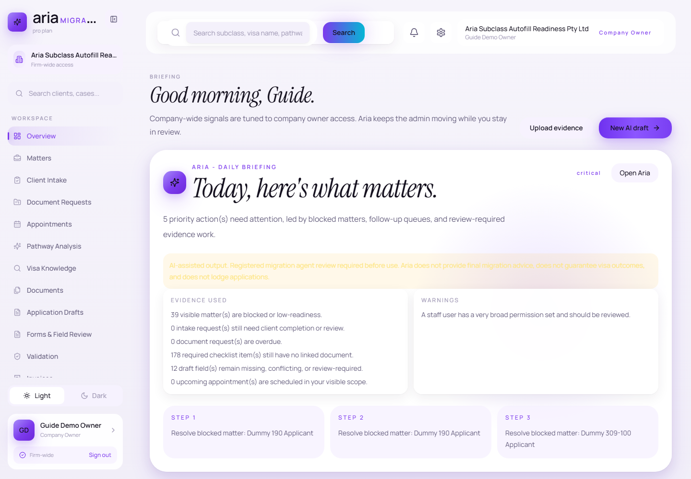

Caption: Owner Dashboard screen captured from localhost with dummy/local-safe context.

## 4. Company And Workspace Settings

Workspace settings include company profile, AI settings, document settings, forms settings, appointment settings, client portal settings, security, and data controls where configured.

Settings pages are owner/admin controlled and should persist only through existing app forms and APIs.

Launch readiness records security, privacy, subclass support, operations, and product checks without saying Aria is legally compliant or fully secure.

Use settings to control how the workspace operates: whether AI draft autofill is enabled, which document types are accepted, how the client portal behaves, how appointments are requested, and how data export/archive controls appear.

Security and launch pages are operational checklists. They are there to help the owner spot configuration gaps before using real client workflows.

1. Open /app/company for company profile details.
2. Open /app/settings for the settings index.
3. Use /app/settings/security for security status and /app/settings/security/launch-readiness for launch readiness.
4. Review AI, cron, encryption, email, client portal, document, forms, appointment, and export settings before inviting clients.
5. Keep unsupported workflows disabled or clearly labelled rather than relying on staff memory.

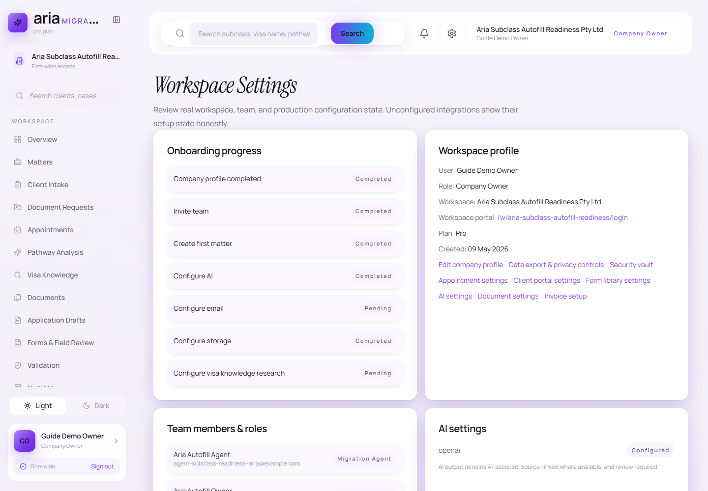

Caption: Company And Workspace Settings screen captured from localhost with dummy/local-safe context.

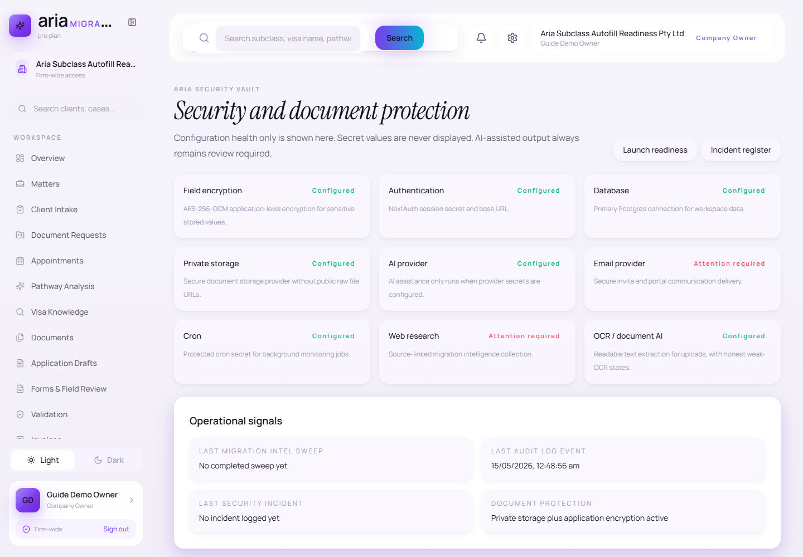

Caption: Company And Workspace Settings screen captured from localhost with dummy/local-safe context.

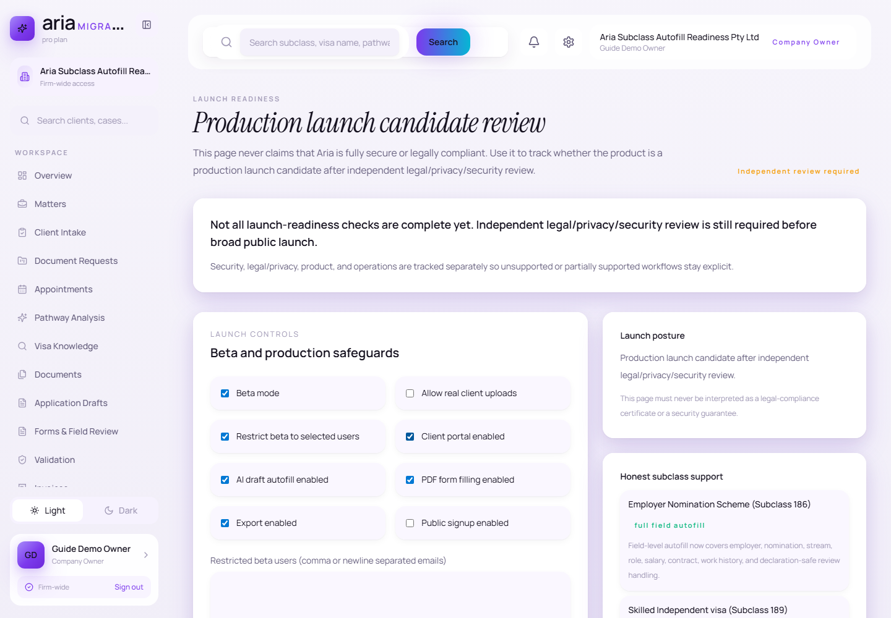

Caption: Company And Workspace Settings screen captured from localhost with dummy/local-safe context.

## 5. Team And Agent Management

The team page lets authorised owners/admins invite staff, manage roles, and maintain assigned-only agent access.

Agent isolation is central to Aria: one assigned agent should not see another agent's private client, matter, document, draft, export, or assistant context.

Use roles deliberately. A company owner should be rare, admins should be trusted operational users, agents should generally work within assigned matter scope, and support/staff users should receive only the permissions they need.

When adding a new staff member, confirm the invite email, role, visibility scope, and whether they need firm-wide access or assigned-only access.

1. Open /app/team as an authorised owner/admin.
2. Invite staff or agents with the correct role.
3. Assign matters to agents from the matter workflow.
4. Use role permissions and assignment scope to separate agent data.
5. After changing a role, test the user can access only the expected matters and settings.
6. Deactivate users promptly when they leave the practice or no longer need access.

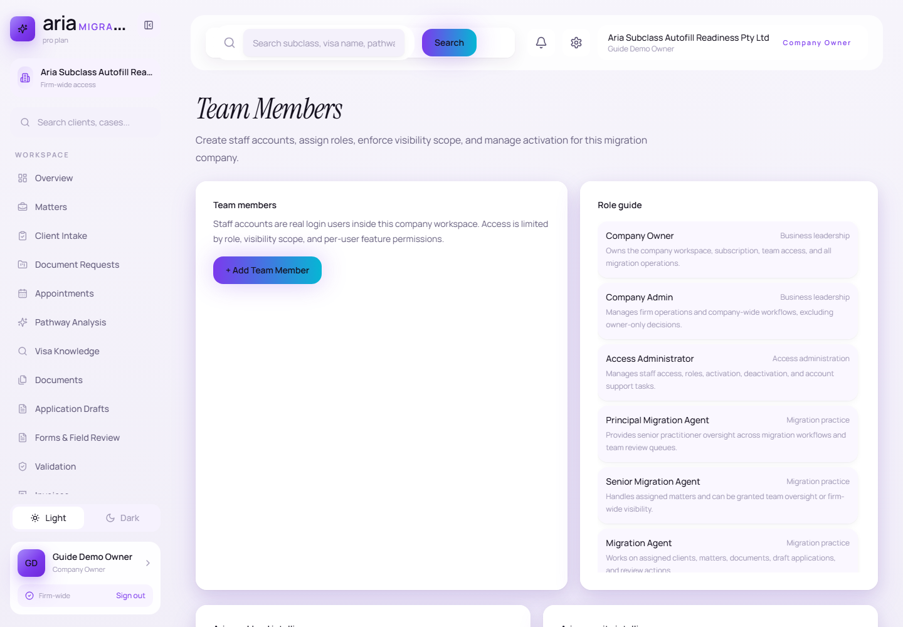

Caption: Team And Agent Management screen captured from localhost with dummy/local-safe context.

## 6. Clients

Client records connect people to matters, documents, client portal links, intake requests, confirmations, appointments, and generated documents.

Client data remains workspace scoped and permission checked.

In the current app, client context is visible inside the matter workflow and related client-facing portal flows. A separate /app/clients route was not present in this build.

A client record is not just contact information. It becomes the anchor for the matter, document evidence, appointment requests, portal links, confirmation answers, and generated outputs.

Be careful with names, dates of birth, passports, grant numbers, addresses, and notes. Those values are private client data and should only appear in authorised views.

1. Open the clients area if enabled in the current navigation.
2. Create or view a client record.
3. Link the client to matters and portal workflows.

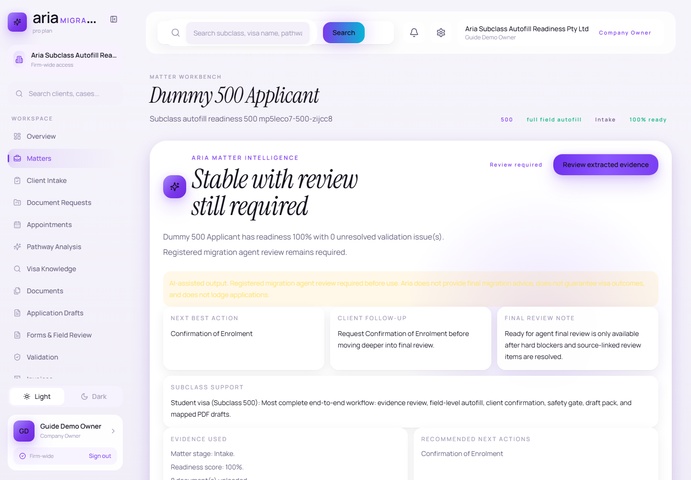

Caption: Clients screen captured from localhost with dummy/local-safe context.

## 7. Matters

Matters are the core workflow hub. A matter has a client, subclass, assignment, status, review dashboard, checklist, draft fields, forms, generated documents, and safety gate status.

Matter pages include /app/matters, /app/matters/[matterId], /review, /draft, /forms, /checklist, and /generated-documents.

The matter detail page is the operational hub. It shows who the matter belongs to, which subclass applies, what stage the matter is in, which tasks and documents are outstanding, and which Aria actions are available.

Matter status is preparation status, not legal approval. Even if Aria shows strong readiness, the agent must review the facts, evidence, and legal position before use.

1. Create a matter from the matters page.
2. Choose the visa subclass honestly.
3. Assign the responsible agent.
4. Upload dummy or client-authorised documents.
5. Use the review and draft pages to prepare the file for agent final review.
6. Use generated documents and forms only after reviewing missing evidence and safety warnings.
7. Never use another client's matter as a shortcut or template unless the app provides an approved reusable firm template workflow.

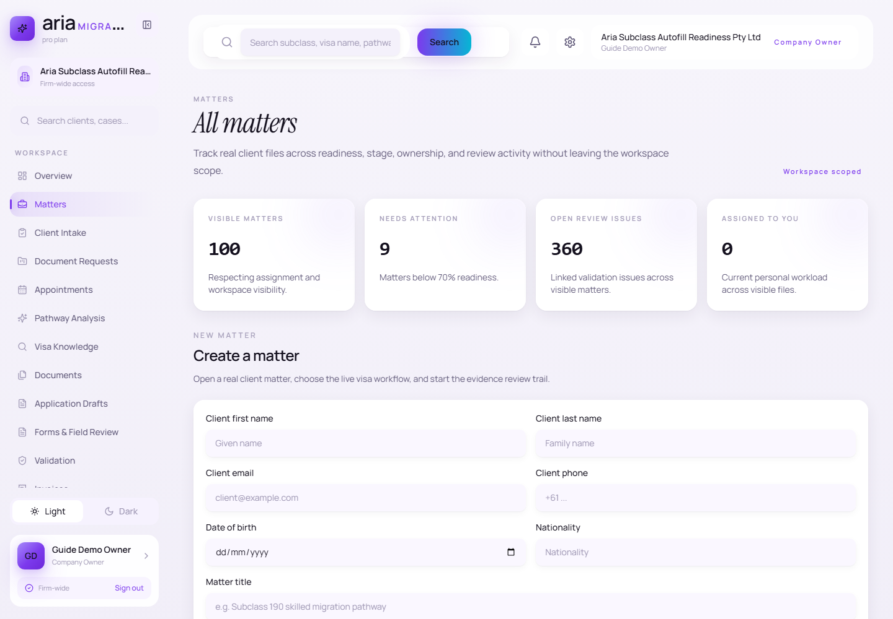

Caption: Matters screen captured from localhost with dummy/local-safe context.

Caption: Matters screen captured from localhost with dummy/local-safe context.

## 8. Documents

Documents can be uploaded and linked to clients/matters. Downloads should go through permission-checked app routes.

Aria stores extraction status, source metadata, checksums, and secure document references without exposing raw public storage URLs.

Document uploads are the start of the evidence chain. A document can support extracted fields, checklist items, draft answers, client confirmations, and safety gate checks.

Use clear scans and correctly labelled document categories where possible. Poor scans, mismatched file types, or unclear documents may reduce extraction confidence and increase review work.

1. Open /app/documents.
2. Upload supported file types only.
3. Link documents to a matter/client.
4. Review extraction status and evidence mapping from the matter review dashboard.
5. Do not share raw file links. Use the built-in secure download and client portal flows.
6. If a document contains sensitive identity information, confirm that only authorised users can access it.

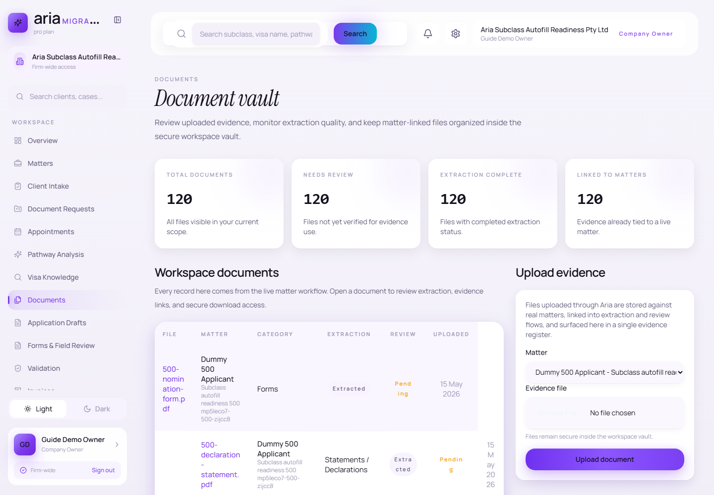

Caption: Documents screen captured from localhost with dummy/local-safe context.

## 9. Extracted Evidence Review

The matter review dashboard shows extracted fields, confidence, source document references, snippets where authorised, missing evidence, conflicts, and safety warnings.

Unsafe declaration fields stay review-required and client-confirmation-required where applicable.

Use this screen to compare what Aria extracted against the actual evidence. A high confidence score is useful, but it is not a substitute for agent judgment.

Conflicts matter. If two documents disagree on a name, date, passport number, grant number, address, relationship date, employment period, or points claim, resolve the conflict before relying on the draft.

1. Open the Review page for a matter.
2. Check each evidence section relevant to the subclass.
3. Review confidence, source document, page reference, and source snippet where available.
4. Resolve missing evidence, low-confidence fields, and conflicts before moving to final review.
5. Leave health, character, relationship, points, and declaration fields review-required unless the client and agent have confirmed them.

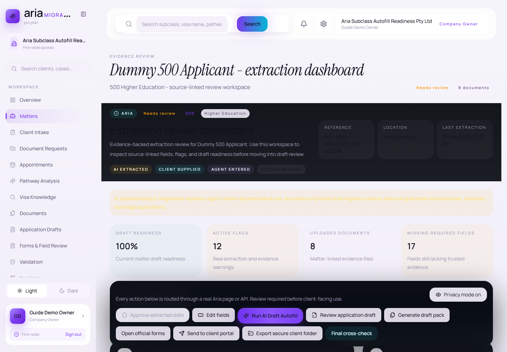

Caption: Extracted Evidence Review screen captured from localhost with dummy/local-safe context.

## 10. AI Draft Autofill

AI draft autofill maps evidence-backed extracted fields into application draft fields. It preserves verified fields and keeps unsafe or unsupported fields in review-required states.

The app uses the wording Ready for agent final review, not Ready to lodge.

Autofill is designed to reduce manual data entry and highlight source-backed values. It should not invent missing facts, infer legal conclusions, or finalise declarations.

Every populated value should be traceable to a source, confidence level, and review status. If the source is missing or weak, the field should remain review-required.

1. Open a matter draft page.
2. Run draft autofill.
3. Review source-backed populated fields.
4. Verify, edit, or reject each field.
5. Rerun autofill if needed; verified fields should not be overwritten.
6. Send client confirmation for personal details, documents, health/character declarations, relationship details, study/GTE, financial capacity, employment, insurance, visitor travel purpose, or skilled points where relevant.
7. Use final review only after blockers and client confirmations have been resolved.

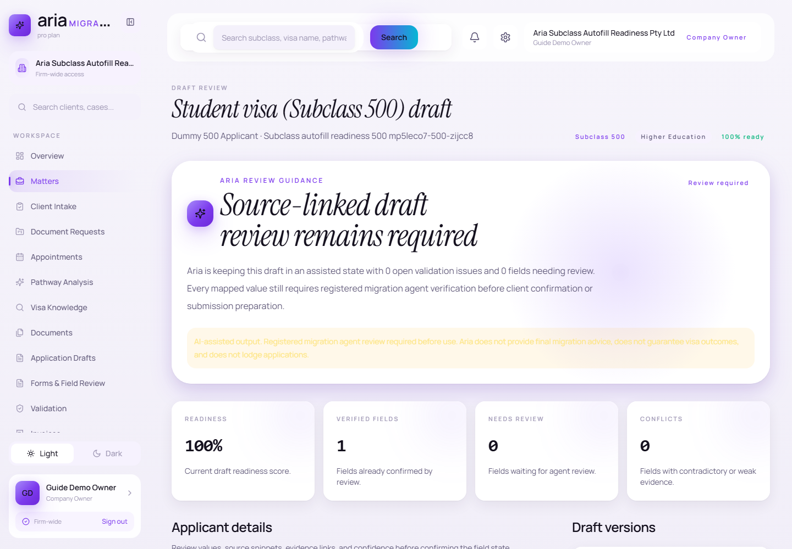

Caption: AI Draft Autofill screen captured from localhost with dummy/local-safe context.

## 11. Application Drafts

The application drafts area lists draft work across the workspace. A matter draft page shows field readiness, source-linked field evidence, verified fields, conflicts, and draft versions.

Fields can be verified, edited, or rejected by an authorised user. Verified fields are protected from overwrite during later autofill runs.

Drafts remain agent-review-required and use the safety wording Ready for agent final review rather than Ready to lodge.

A draft version helps the practice understand what changed over time. Use versions to compare field population, reviewed fields, missing evidence, and warnings.

If a draft field looks complete but has no evidence link, treat it as unsupported until a source is attached or the agent manually verifies it with notes.

1. Open /app/application-drafts to review draft activity.
2. Open a matter draft page for field-level review.
3. Review each populated value against the evidence panel and confidence status.
4. Verify only after the agent is satisfied the value is supported.
5. Reject or edit fields that are incorrect, unsupported, stale, or inconsistent.
6. Do not publish or export client-facing draft material until the agent has completed review.

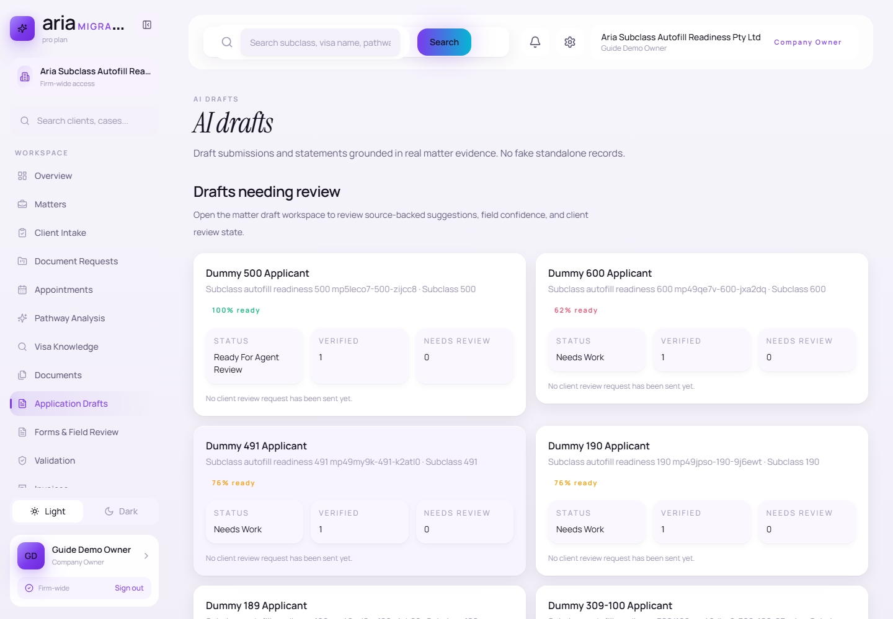

Caption: Application Drafts screen captured from localhost with dummy/local-safe context.

Caption: Application Drafts screen captured from localhost with dummy/local-safe context.

## 12. Subclass Support

Current supported subclasses are 500, 485, 482, 186, 820/801, 309/100, 189, 190, 491, and 600.

The launch-readiness/subclass-support pages label support honestly. A subclass should show FULL_FIELD_AUTOFILL only when field definitions, extraction mappings, draft autofill, client confirmations, safety gate, review sections, PDF/template mapping, and dummy end-to-end checks exist.

Unsupported or online-only workflows must be labelled honestly.

Support level does not mean Aria lodges the visa. It means Aria has preparation coverage for the relevant workflow components inside the SaaS.

For skilled subclasses, pay particular attention to points claims, skills assessment validity, English results, employment dates, nomination documents, and evidence-backed assumptions. For partner subclasses, pay particular attention to relationship evidence categories, timelines, witness statements, sponsor status, and declarations.

1. Open launch readiness or admin subclass support.
2. Confirm the support level for the subclass before creating client expectations.
3. Check whether official forms are fillable, manual, online-only, unsupported, or needs review.
4. If a subclass is partial or disabled, use checklist/review support only and do not claim end-to-end field autofill.

Caption: Subclass Support screen captured from localhost with dummy/local-safe context.

## 13. Client Confirmations And Portal

Client confirmations are matter-scoped requests for personal details, document accuracy, health/character declarations, family/relationship information, study/GTE, finances, employment, insurance, visitor travel purpose/home ties, skilled points, and sponsor/nomination details where relevant.

The client portal uses secure scoped links. Clients should only see their matter/client-facing actions, not internal notes, staff data, audit logs, AI reasoning, settings, or other client matters.

Client confirmation is not legal approval. It is the client's confirmation of facts, documents, and declarations for the agent to review.

Portal links should be treated like sensitive access links. Revoke old links when no longer needed and generate fresh links when a client reports access issues.

1. Generate a portal/confirmation link from the matter workflow.
2. Send the secure link using the configured email flow or manual copy fallback.
3. Client uploads documents or submits confirmations.
4. Agent reviews the returned answers before using them.
5. If a client changes a declaration or personal detail, rerun review/safety checks before relying on the draft.
6. Confirm portal screens never show another client's matter, internal notes, staff-only data, audit logs, token hashes, or raw document URLs.

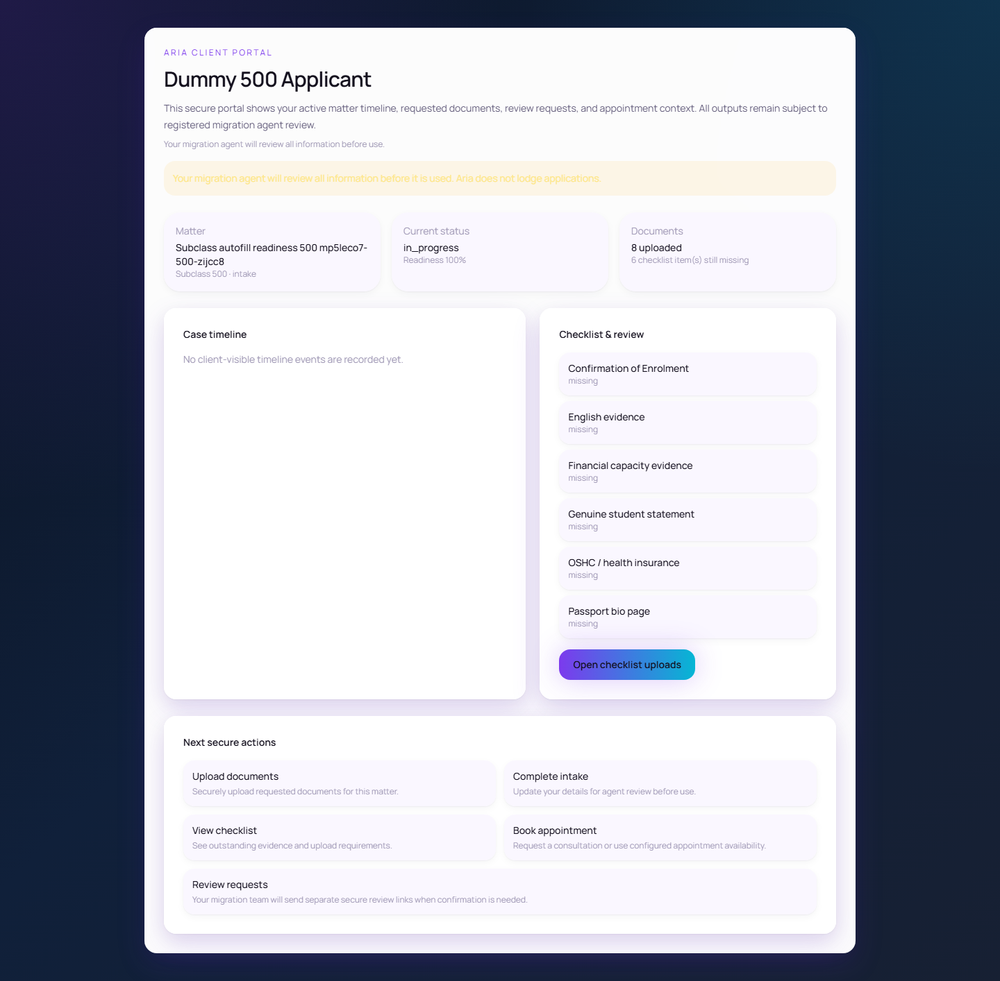

Caption: Client Confirmations And Portal screen captured from localhost with dummy/local-safe context.

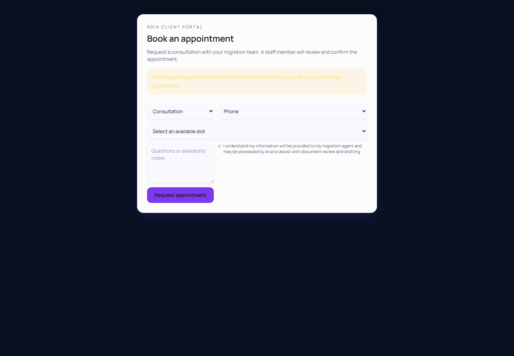

Caption: Client Confirmations And Portal screen captured from localhost with dummy/local-safe context.

## 14. Appointments

Appointments support settings, request/booking flows, and client-facing booking pages where configured.

If availability or email is not configured, Aria should show an honest fallback rather than pretending a booking was confirmed.

Use appointments for consultation requests, evidence review sessions, follow-up calls, and final review meetings. Appointment status should be confirmed by staff where the workflow requires manual confirmation.

Client booking pages should be simple and scoped: the client should not see internal calendars, staff settings, audit logs, or unrelated matters.

1. Open appointment settings to configure timezone, types, availability, meeting methods, and request fallback where available.
2. Generate or share the client booking route when appropriate.
3. Review incoming appointment requests before confirming.
4. Cancel or reschedule using the app workflow rather than editing records outside the system.

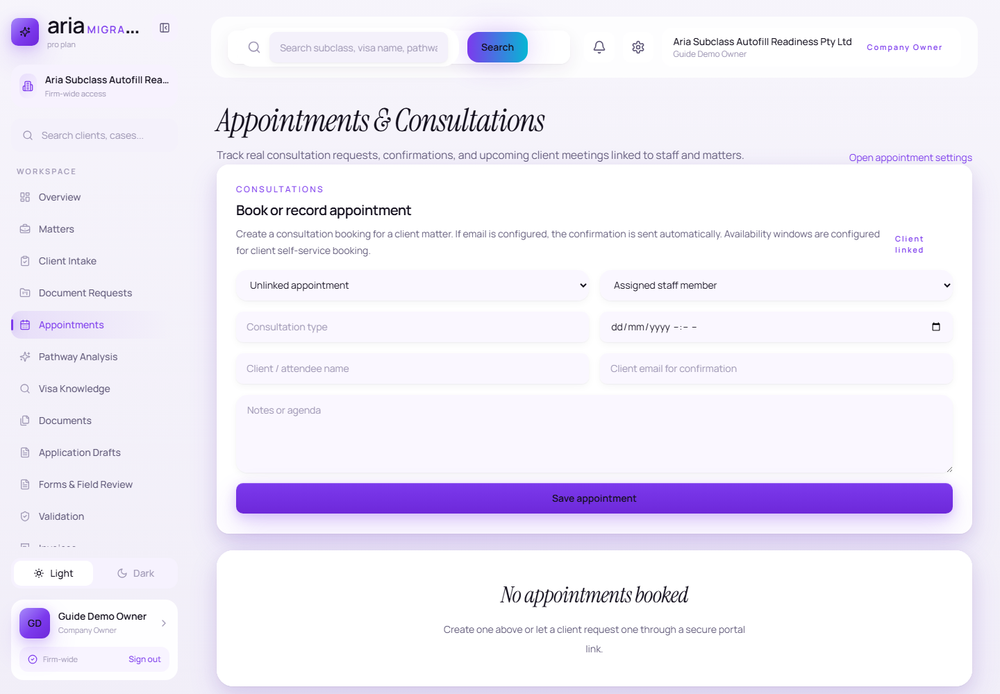

Caption: Appointments screen captured from localhost with dummy/local-safe context.

Caption: Appointments screen captured from localhost with dummy/local-safe context.

## 15. Official Forms And Company PDF Templates

Aria tracks official forms and firm PDF templates with labels such as fillable, manual, online-only, unsupported, or needs review.

Companies can upload firm templates, detect PDF fields, map canonical Aria field keys, and generate draft PDFs where supported.

Aria must not auto-sign, auto-lodge, or claim a form was submitted.

Use official form labels carefully. Some Home Affairs workflows are online-only or require manual completion in external systems. Aria should support preparation and draft review without pretending to submit anything.

Firm templates are useful for practice-specific cover letters, questionnaires, checklists, and internal PDFs. Field mapping should use canonical keys so the same evidence-backed values can fill supported templates consistently.

1. Open /app/forms for the form library and support labels.
2. Open a matter forms page to see relevant forms and draft options for that matter.
3. Upload a firm PDF template only if it is safe, dummy/tested, and intended for mapping.
4. Map detected PDF fields to Aria canonical keys.
5. Generate a draft PDF, review blank/needs-review fields, and never auto-sign.

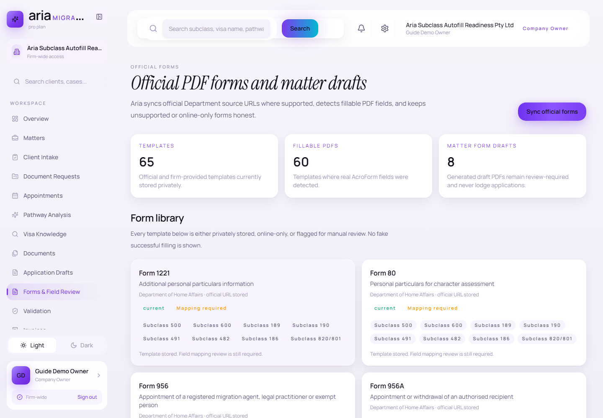

Caption: Official Forms And Company PDF Templates screen captured from localhost with dummy/local-safe context.

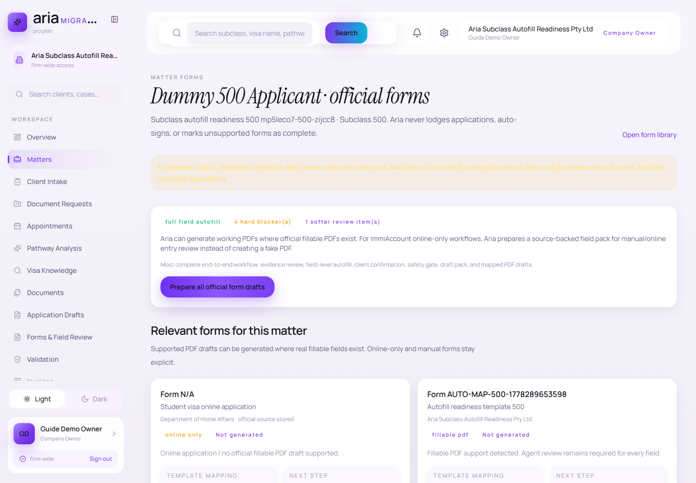

Caption: Official Forms And Company PDF Templates screen captured from localhost with dummy/local-safe context.

## 16. Generated Documents And Draft Packs

Generated documents and draft packs may include checklists, draft PDFs, summaries, covering letters, and missing-evidence warnings depending on the matter and configured templates.

Every generated output remains agent-review-required and permission checked.

Generated outputs should make review easier, not replace it. Check that every section belongs to the current matter, contains no other client's data, and clearly marks missing or uncertain material.

If a generated document includes client-facing text, ensure it includes the correct company details, agent details, terms/conditions where configured, and the appropriate review wording.

1. Open the generated documents page for the matter.
2. Generate the draft pack or mapped PDF only after evidence review has run.
3. Check warnings, unsupported fields, blank fields, and missing evidence before sharing.
4. Download or publish only through permission-checked app routes.

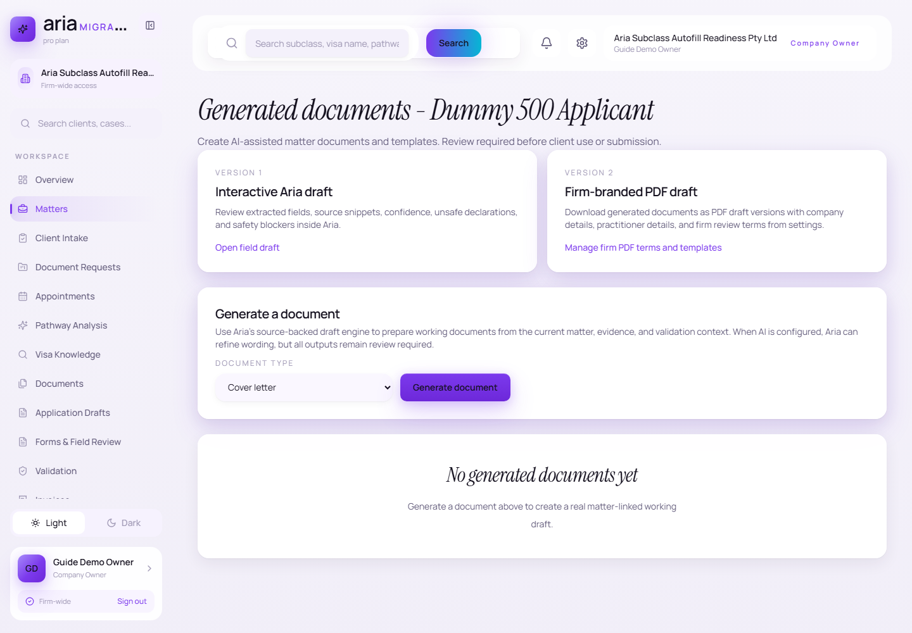

Caption: Generated Documents And Draft Packs screen captured from localhost with dummy/local-safe context.

## 17. Invoices

If enabled, invoices include setup, manual invoice creation, generated invoice drafts, logo/signature settings where present, and invoice detail pages.

Invoices should document billing metadata only and avoid exposing unrelated client private data.

The invoice area is separate from legal preparation. Treat it as operational billing support and confirm amounts, taxes, services, recipients, and payment instructions before sending.

If AI invoice generation is available, review every line item before use. The app should not invent fees, claim work was completed, or expose private matter content unnecessarily.

1. Open /app/invoices to see invoices and billing workflow.
2. Configure invoice branding/assets if the setup page is enabled.
3. Create a manual invoice or use a generated draft if available.
4. Review recipient, services, totals, due dates, and notes before download or sending.

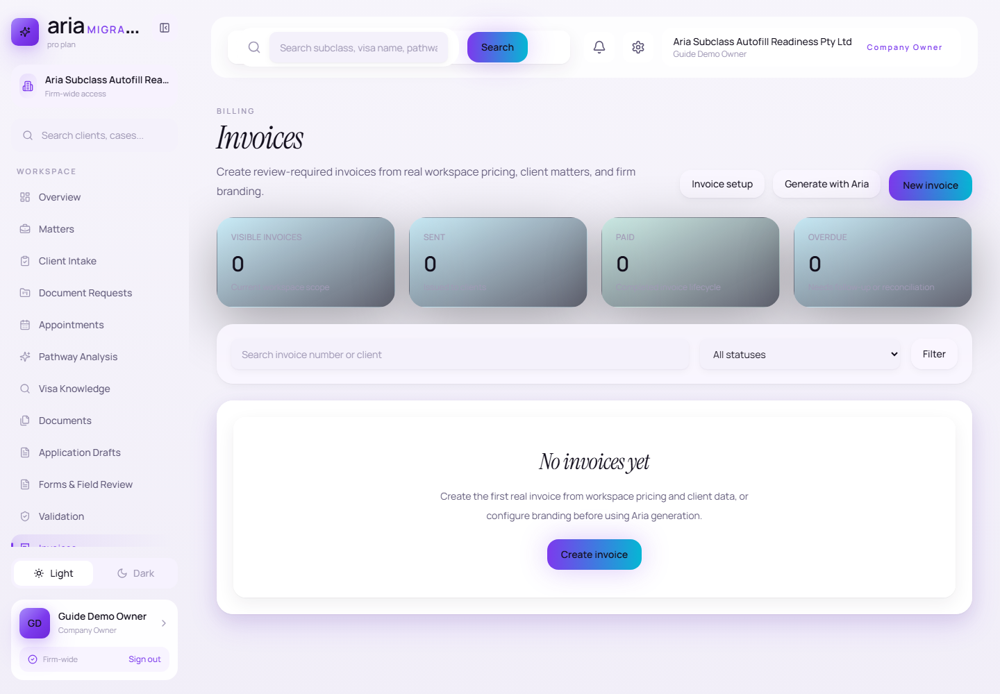

Caption: Invoices screen captured from localhost with dummy/local-safe context.

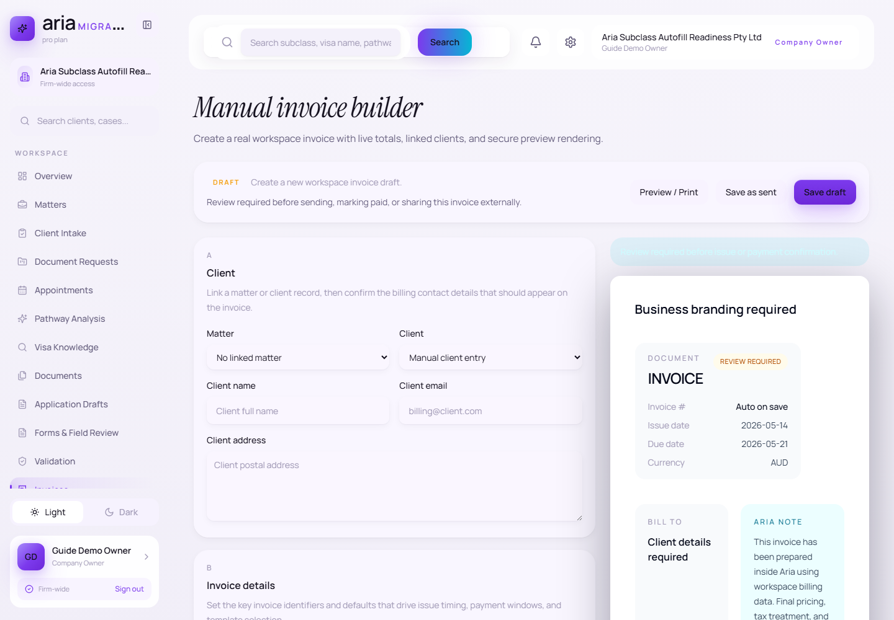

Caption: Invoices screen captured from localhost with dummy/local-safe context.

## 18. Ask Aria Assistant

Ask Aria is an AI-assisted workspace/matter assistant with source/evidence panels, confidence, missing information, warnings, and recommended next actions.

Aria should answer within the user's permission scope only. It should not reveal hidden matters, guarantee outcomes, provide final legal advice, or say an application can be lodged without review.

Good prompts ask for evidence summaries, missing items, risk flags, next administrative steps, or draft review checklists. Unsafe prompts ask Aria to guarantee an outcome, decide legal eligibility finally, or lodge without review.

Every answer involving migration facts should include evidence used, source type, confidence, missing information, a review-required warning, and a recommended next action where the feature is configured.

1. Open /app/assistant.
2. Choose workspace or matter context.
3. Ask a specific question.
4. Read the answer, evidence used, confidence, missing information, and review warning.
5. Treat the response as agent-review-required.
6. If the response references a client, matter, document, or fact outside your permitted scope, stop and report it as a privacy issue.
7. Do not paste real secrets, passwords, API keys, or unnecessary raw document text into prompts.

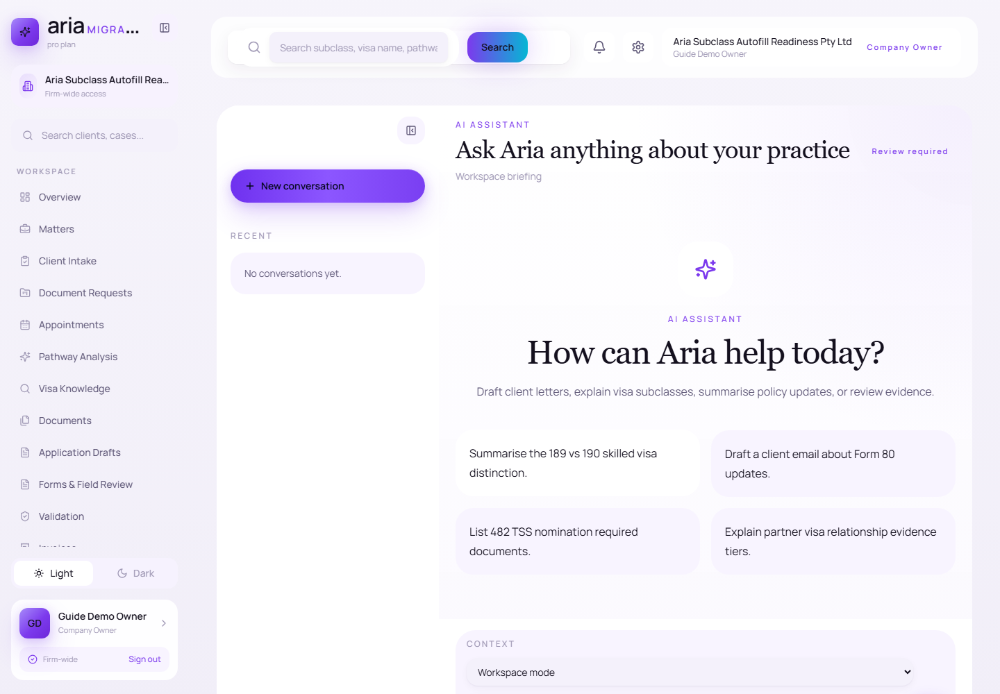

Caption: Ask Aria Assistant screen captured from localhost with dummy/local-safe context.

## 19. Visa Knowledge And Migration Updates

Visa Knowledge and Updates distinguish official source material, workspace notes, migration intelligence, and news/intel where configured.

Search, filters, badges, source labels, and update sweeps must remain readable in both light and dark mode.

Use Visa Knowledge for research support and operational awareness. Confirm official rules and policy directly with authoritative sources before relying on them in client advice.

Migration updates can help surface changes that may affect a workspace, but they should not silently change client strategy or final advice.

1. Open /app/knowledge to search stored knowledge records.
2. Use source labels to distinguish official material from news, intel, or workspace notes.
3. Open /app/updates for migration updates and review workflows.
4. Escalate relevant updates to the responsible agent for review before applying them to a matter.

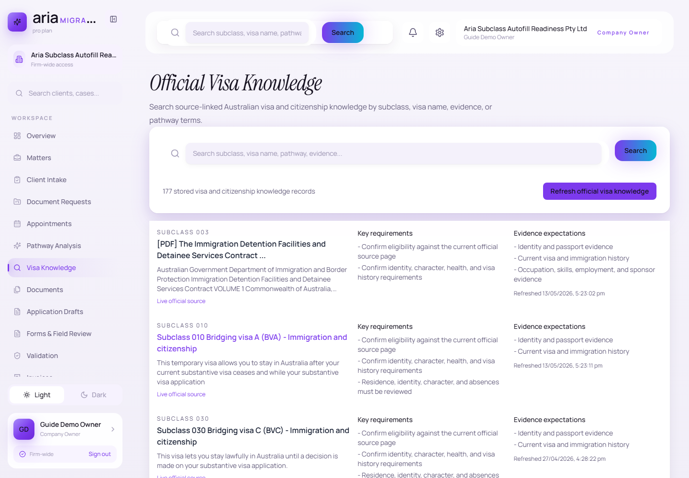

Caption: Visa Knowledge And Migration Updates screen captured from localhost with dummy/local-safe context.

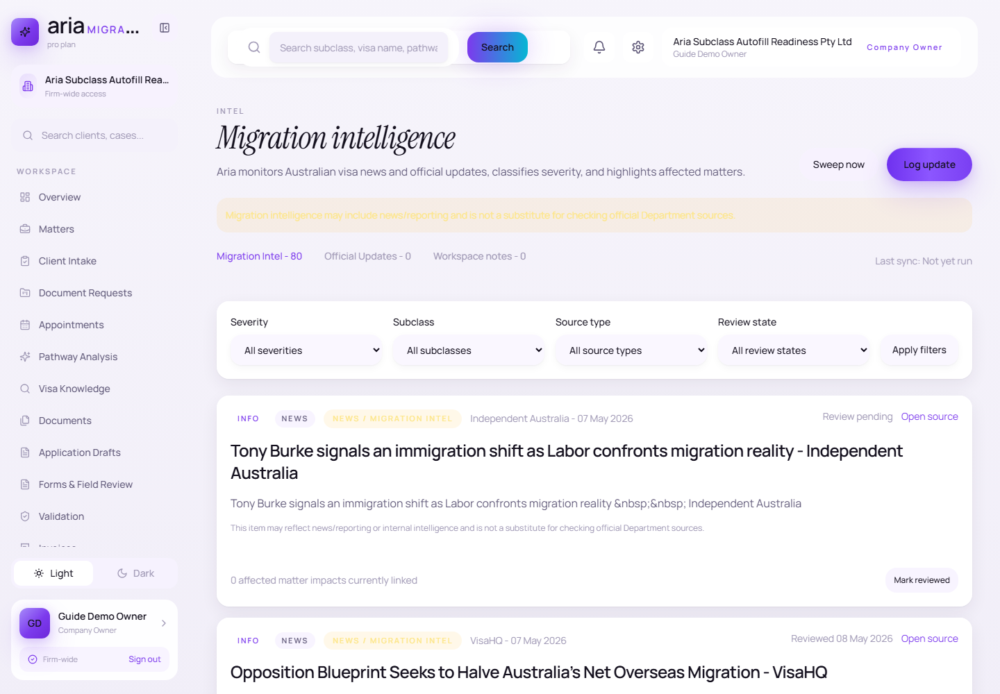

Caption: Visa Knowledge And Migration Updates screen captured from localhost with dummy/local-safe context.

## 20. Security, Audit, Data Export, And Incidents

Security pages show runtime booleans and status, not secrets. Launch readiness tracks encryption, AI, cron, permissions, portal scoping, audit logging, legal/privacy review, support levels, and operational controls.

Audit logs should record important actions while redacting raw tokens, tokenHash, raw document URLs, passport numbers, DOB plaintext, extracted text, draft answers, and source snippets.

Data export and secure client folder exports require permission and should contain only the intended matter/client material.

Use the security pages before using production client data. Encryption, cron, AI, email, storage, permissions, portal scoping, audit logging, launch controls, and incident workflows should be checked.

Incident register workflows, if present, should record suspected issues, severity, containment, follow-up, and export/report needs without exposing unnecessary private content.

1. Open /app/settings/security and review configured/not-configured runtime status.
2. Open launch readiness and review every security, legal/privacy, product, and operations item.
3. Use audit logs to confirm key events are recorded and sensitive metadata is redacted.
4. Use data export/archive/delete controls carefully and follow retention obligations before removing records.

Caption: Security, Audit, Data Export, And Incidents screen captured from localhost with dummy/local-safe context.

Caption: Security, Audit, Data Export, And Incidents screen captured from localhost with dummy/local-safe context.

## 21. Light And Dark Mode

The sidebar theme toggle persists the selected theme locally. Light mode uses pale lavender/off-white backgrounds with dark readable text; dark mode uses near-black purple surfaces with light readable text.

Inputs, selects, textareas, dropdowns, tables, assistant panels, Visa Knowledge, client portal, auth pages, and admin pages should remain readable in both themes.

If a page shows dark text on a dark surface, light text on a white field, invisible placeholders, or unreadable disabled states, treat it as a visual bug.

Theme changes should not change permissions, data visibility, workflow status, or form submission behaviour.

1. Use the Light/Dark segmented toggle in the sidebar.
2. Check inputs, buttons, badges, tables, warnings, dropdowns, and empty states after switching.
3. If a screen looks wrong, refresh once to confirm the persisted theme state, then report the specific route and component.

Caption: Light And Dark Mode screen captured from localhost with dummy/local-safe context.

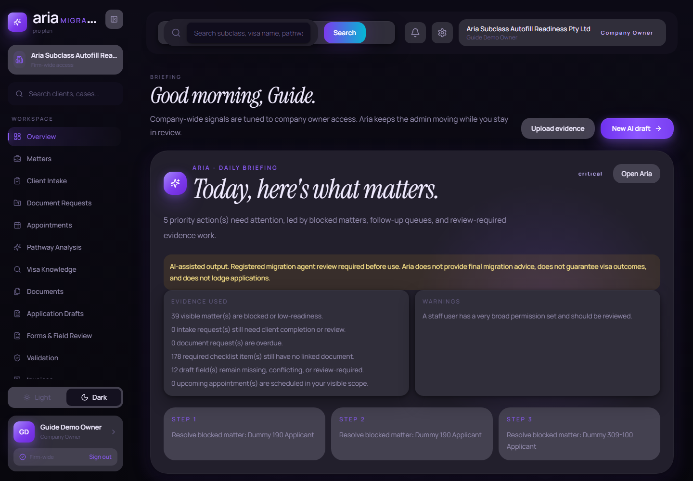

Caption: Light And Dark Mode screen captured from localhost with dummy/local-safe context.

## 22. Common Workflow

A normal controlled workflow is: owner creates workspace, owner invites agent, agent creates matter, agent uploads documents, Aria extracts evidence, agent reviews evidence, agent runs draft autofill, agent verifies fields, agent requests client confirmation, client responds in the portal, agent runs final cross-check, agent generates draft PDF/pack, and owner exports a secure client folder if needed.

Use this workflow as a disciplined operating rhythm. It keeps evidence review before draft use, client confirmation before declaration reliance, and agent final review before anything leaves the practice.

The workflow is intentionally conservative. It helps avoid common mistakes: relying on unsupported fields, losing sight of missing evidence, exposing the wrong client data, or sending client-facing material before agent review.

AI-assisted output. Registered migration agent review required before use. Aria does not provide final migration advice, does not guarantee visa outcomes, and does not lodge applications.

1. Owner creates or configures the workspace and confirms launch controls.
2. Owner/admin invites the responsible agent and confirms permissions.
3. Agent creates the matter, chooses the subclass, and assigns responsibility.
4. Agent or client uploads evidence through secure document workflows.
5. Aria extracts evidence and the agent reviews fields, confidence, snippets, missing items, and conflicts.
6. Agent runs draft autofill and verifies, edits, or rejects each field.
7. Agent sends client confirmations for facts and declarations that need client action.
8. Client responds through the scoped portal link.
9. Agent reruns checks, resolves blockers, and prepares generated documents or mapped PDFs.
10. Agent completes final review before any use outside Aria.

## 23. Troubleshooting

AI not configured: assistant/draft features show an honest setup message or disabled state.

Encryption missing: production upload should be blocked or clearly marked unsafe until configured.

Email not configured: use manual copy-link fallback where implemented.

Upload blocked: check file type, size, MIME type, and workspace launch controls.

Form not fillable: use manual/online-only state and do not pretend PDF filling succeeded.

Portal link expired or revoked: generate a fresh link if authorised.

Staff cannot access matter: check assignment, visibility scope, and role permissions.

No extracted fields found: upload clearer documents or review OCR/extraction confidence.

## 24. Safety And Legal Reminders

Review by a qualified Australian lawyer/privacy professional before commercial use.

AI-assisted output. Registered migration agent review required before use. Aria does not provide final migration advice, does not guarantee visa outcomes, and does not lodge applications.

Do not delete records that must be retained for law, professional obligations, disputes, audits, or client engagement requirements.

Do not use real client data until the organisation completes independent legal, privacy, and security review.

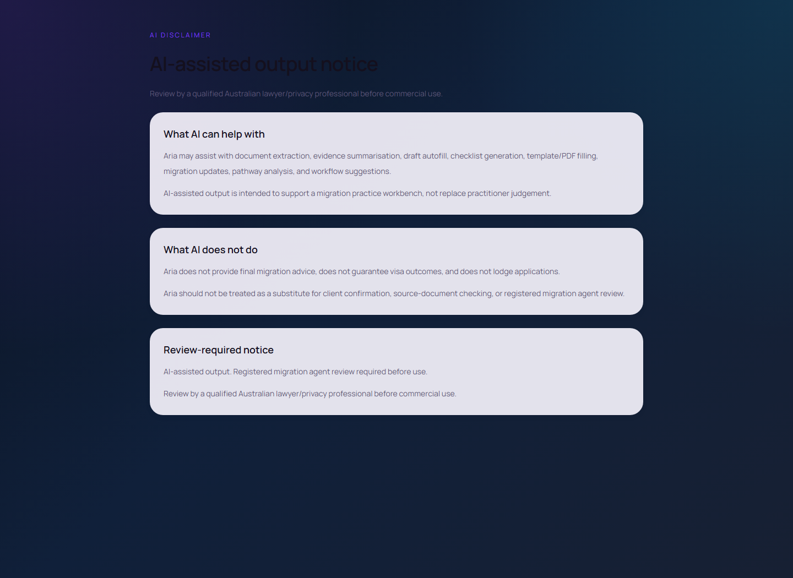

Caption: Safety And Legal Reminders screen captured from localhost with dummy/local-safe context.

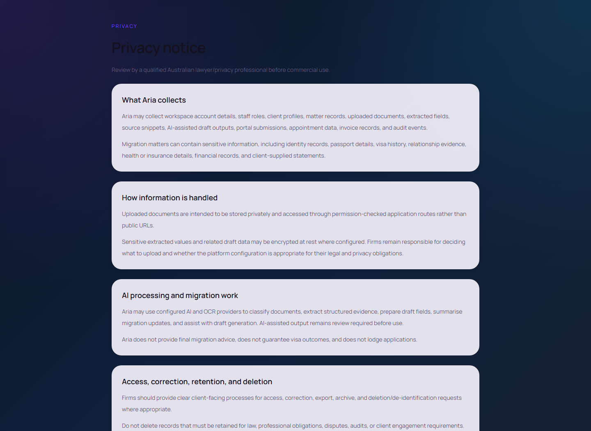

Caption: Safety And Legal Reminders screen captured from localhost with dummy/local-safe context.

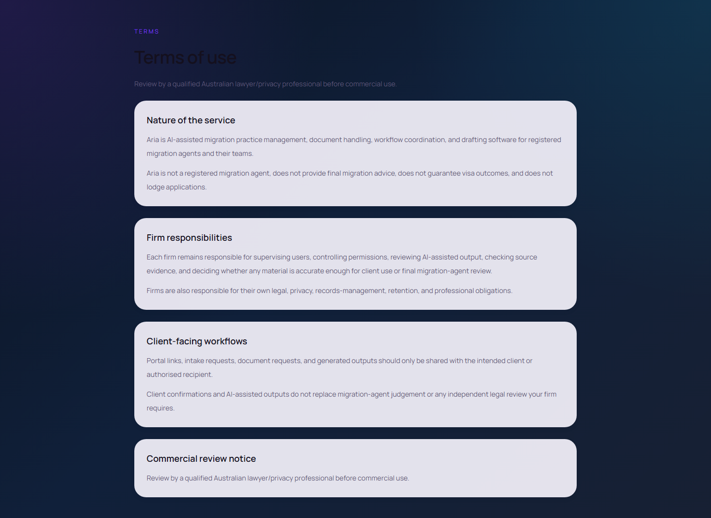

Caption: Safety And Legal Reminders screen captured from localhost with dummy/local-safe context.

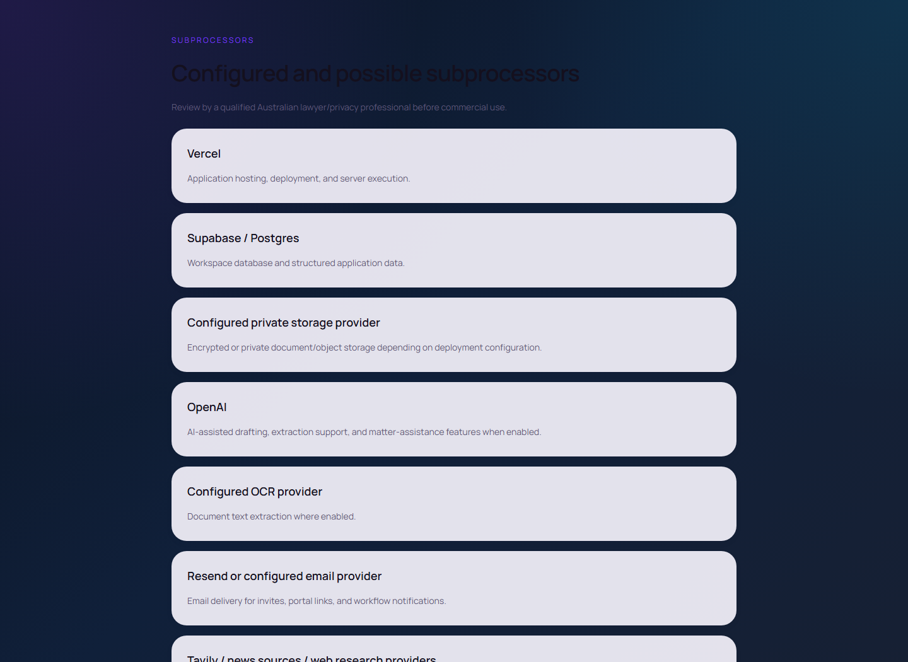

Caption: Safety And Legal Reminders screen captured from localhost with dummy/local-safe context.
