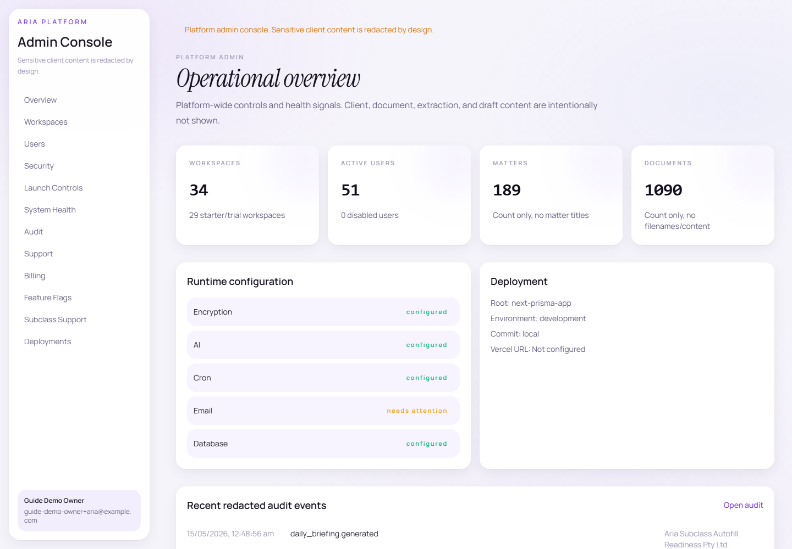
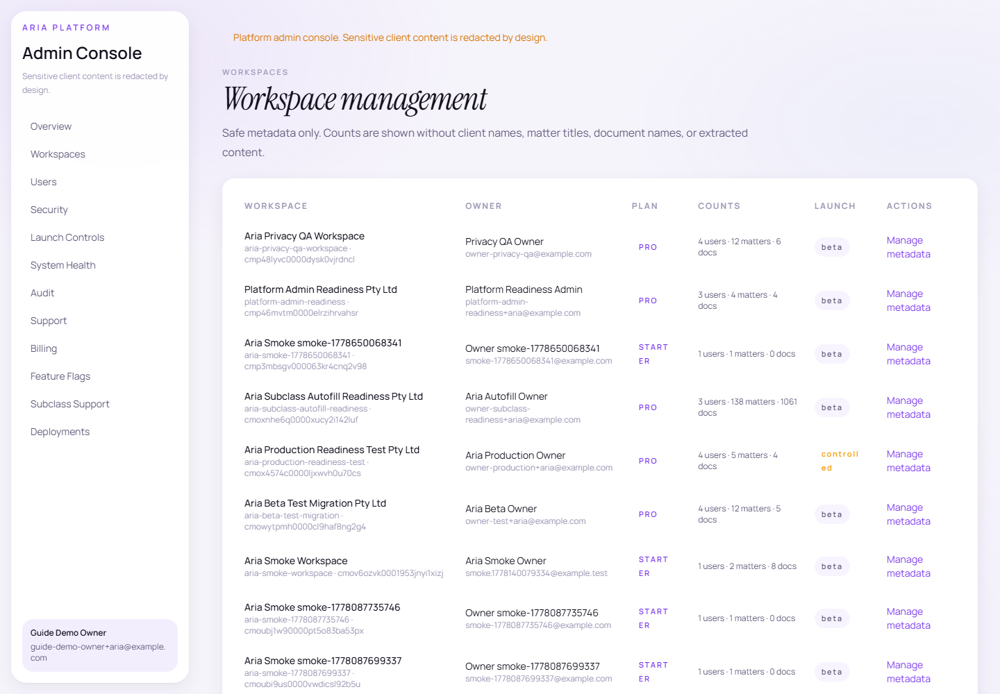
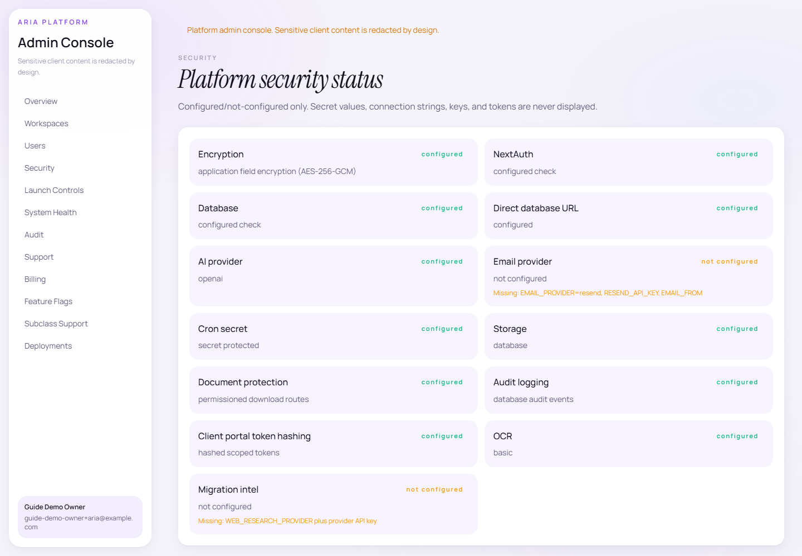
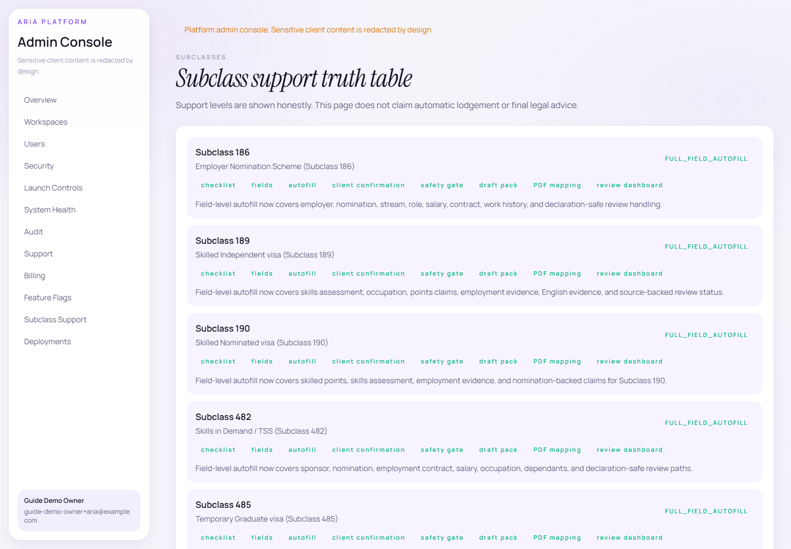

# Aria Migration SaaS User Guide

Generated: 15/05/2026

> AI-assisted output. Registered migration agent review required before use. Aria does not provide final migration advice, does not guarantee visa outcomes, and does not lodge applications.

> Screenshot note: screenshots were captured from localhost with dummy guide data only. The guide does not include real client data, secrets, raw tokens, token hashes, or raw document URLs.

## Table Of Contents

1. Introduction
2. Account Creation And Sign In
3. Owner Dashboard
4. Company And Workspace Settings
5. Team And Agent Management
6. Platform Admin Console
7. Clients
8. Matters
9. Documents
10. Extracted Evidence Review
11. AI Draft Autofill
12. Application Drafts
13. Subclass Support
14. Client Confirmations And Portal
15. Appointments
16. Official Forms And Company PDF Templates
17. Generated Documents And Draft Packs
18. Invoices
19. Ask Aria Assistant
20. Visa Knowledge And Migration Updates
21. Security, Audit, Data Export, And Incidents
22. Light And Dark Mode
23. Common Workflow
24. Troubleshooting
25. Safety And Legal Reminders

## 1. Introduction

Aria Migration is a migration-practice SaaS for workspace owners, company admins, migration agents, staff, clients, and privacy-safe platform operators.

Aria helps organise clients, matters, documents, evidence extraction, application draft fields, subclass readiness, client confirmations, appointments, generated draft packs, firm PDF templates, updates, audit logs, launch controls, and AI-assisted practice support.

Aria does not replace a registered migration agent, does not provide final legal advice, does not guarantee visa outcomes, and does not lodge applications automatically.

AI-assisted output. Registered migration agent review required before use. Aria does not provide final migration advice, does not guarantee visa outcomes, and does not lodge applications.

Caption: Introduction screen captured from localhost with dummy/local-safe context.

## 2. Account Creation And Sign In

Workspace owners use the public sign-up/sign-in flow when public signup is enabled by the operator. Staff and agents normally enter through the workspace staff portal or an invite link.

Public signup may be disabled in production until launch controls are approved. That is expected and should be treated as an operational safety setting, not a broken page.

1. Open /auth/sign-up to create an owner workspace when public signup is enabled.
2. Open /auth/sign-in to sign in as a workspace owner.
3. Open /w/[workspaceSlug]/login for staff and agent login.
4. Use invite links to activate staff accounts and set a password.

Caption: Account Creation And Sign In screen captured from localhost with dummy/local-safe context.

Caption: Account Creation And Sign In screen captured from localhost with dummy/local-safe context.

Caption: Account Creation And Sign In screen captured from localhost with dummy/local-safe context.

## 3. Owner Dashboard

The owner dashboard lives at /app/overview. It gives the owner a workspace-wide overview of caseload, recent work, AI and evidence status, and fast actions.

Owners can see workspace-wide data according to their role. Agents and staff remain scoped by role and assignment.

The daily briefing highlights priority actions, blocked matters, follow-up queues, review-required evidence, and the standing review warning.

1. Sign in as the workspace owner.
2. Open Overview from the sidebar.
3. Use cards and quick actions to move into matters, documents, drafts, updates, and settings.

Caption: Owner Dashboard screen captured from localhost with dummy/local-safe context.

## 4. Company And Workspace Settings

Workspace settings include company profile, AI settings, document settings, forms settings, appointment settings, client portal settings, security, and data controls where configured.

Settings pages are owner/admin controlled and should persist only through existing app forms and APIs.

Launch readiness records security, privacy, subclass support, operations, and product checks without saying Aria is legally compliant or fully secure.

1. Open /app/company for company profile details.
2. Open /app/settings for the settings index.
3. Use /app/settings/security for security status and /app/settings/security/launch-readiness for launch readiness.

Caption: Company And Workspace Settings screen captured from localhost with dummy/local-safe context.

Caption: Company And Workspace Settings screen captured from localhost with dummy/local-safe context.

Caption: Company And Workspace Settings screen captured from localhost with dummy/local-safe context.

## 5. Team And Agent Management

The team page lets authorised owners/admins invite staff, manage roles, and maintain assigned-only agent access.

Agent isolation is central to Aria: one assigned agent should not see another agent's private client, matter, document, draft, export, or assistant context.

1. Open /app/team as an authorised owner/admin.
2. Invite staff or agents with the correct role.
3. Assign matters to agents from the matter workflow.
4. Use role permissions and assignment scope to separate agent data.

Caption: Team And Agent Management screen captured from localhost with dummy/local-safe context.

## 6. Platform Admin Console

The platform admin console lives under /admin and is for the SaaS operator, not normal agency owners.

Platform admin views are privacy-safe by design: they show workspace/user metadata, counts, statuses, launch controls, system health, deployment info, subclass support, billing/plan metadata, and redacted audit summaries.

Platform admin pages must not show uploaded document contents, extracted text, draft field values, passport numbers, DOBs, visa grant numbers, raw document URLs, raw tokens, token hashes, or secrets.

Caption: Platform Admin Console screen captured from localhost with dummy/local-safe context.

Caption: Platform Admin Console screen captured from localhost with dummy/local-safe context.

Caption: Platform Admin Console screen captured from localhost with dummy/local-safe context.

Caption: Platform Admin Console screen captured from localhost with dummy/local-safe context.

## 7. Clients

Client records connect people to matters, documents, client portal links, intake requests, confirmations, appointments, and generated documents.

Client data remains workspace scoped and permission checked.

In the current app, client context is visible inside the matter workflow and related client-facing portal flows. A separate /app/clients route was not present in this build.

1. Open the clients area if enabled in the current navigation.
2. Create or view a client record.
3. Link the client to matters and portal workflows.

Caption: Clients screen captured from localhost with dummy/local-safe context.

## 8. Matters

Matters are the core workflow hub. A matter has a client, subclass, assignment, status, review dashboard, checklist, draft fields, forms, generated documents, and safety gate status.

Matter pages include /app/matters, /app/matters/[matterId], /review, /draft, /forms, /checklist, and /generated-documents.

1. Create a matter from the matters page.
2. Choose the visa subclass honestly.
3. Assign the responsible agent.
4. Upload dummy or client-authorised documents.
5. Use the review and draft pages to prepare the file for agent final review.

Caption: Matters screen captured from localhost with dummy/local-safe context.

Caption: Matters screen captured from localhost with dummy/local-safe context.

## 9. Documents

Documents can be uploaded and linked to clients/matters. Downloads should go through permission-checked app routes.

Aria stores extraction status, source metadata, checksums, and secure document references without exposing raw public storage URLs.

1. Open /app/documents.
2. Upload supported file types only.
3. Link documents to a matter/client.
4. Review extraction status and evidence mapping from the matter review dashboard.

Caption: Documents screen captured from localhost with dummy/local-safe context.

## 10. Extracted Evidence Review

The matter review dashboard shows extracted fields, confidence, source document references, snippets where authorised, missing evidence, conflicts, and safety warnings.

Unsafe declaration fields stay review-required and client-confirmation-required where applicable.

Caption: Extracted Evidence Review screen captured from localhost with dummy/local-safe context.

## 11. AI Draft Autofill

AI draft autofill maps evidence-backed extracted fields into application draft fields. It preserves verified fields and keeps unsafe or unsupported fields in review-required states.

The app uses the wording Ready for agent final review, not Ready to lodge.

1. Open a matter draft page.
2. Run draft autofill.
3. Review source-backed populated fields.
4. Verify, edit, or reject each field.
5. Rerun autofill if needed; verified fields should not be overwritten.

Caption: AI Draft Autofill screen captured from localhost with dummy/local-safe context.

## 12. Application Drafts

The application drafts area lists draft work across the workspace. A matter draft page shows field readiness, source-linked field evidence, verified fields, conflicts, and draft versions.

Fields can be verified, edited, or rejected by an authorised user. Verified fields are protected from overwrite during later autofill runs.

Drafts remain agent-review-required and use the safety wording Ready for agent final review rather than Ready to lodge.

1. Open /app/application-drafts to review draft activity.
2. Open a matter draft page for field-level review.
3. Review each populated value against the evidence panel and confidence status.
4. Verify only after the agent is satisfied the value is supported.

Caption: Application Drafts screen captured from localhost with dummy/local-safe context.

Caption: Application Drafts screen captured from localhost with dummy/local-safe context.

## 13. Subclass Support

Current supported subclasses are 500, 485, 482, 186, 820/801, 309/100, 189, 190, 491, and 600.

The launch-readiness/subclass-support pages label support honestly. A subclass should show FULL_FIELD_AUTOFILL only when field definitions, extraction mappings, draft autofill, client confirmations, safety gate, review sections, PDF/template mapping, and dummy end-to-end checks exist.

Unsupported or online-only workflows must be labelled honestly.

Caption: Subclass Support screen captured from localhost with dummy/local-safe context.

Caption: Subclass Support screen captured from localhost with dummy/local-safe context.

## 14. Client Confirmations And Portal

Client confirmations are matter-scoped requests for personal details, document accuracy, health/character declarations, family/relationship information, study/GTE, finances, employment, insurance, visitor travel purpose/home ties, skilled points, and sponsor/nomination details where relevant.

The client portal uses secure scoped links. Clients should only see their matter/client-facing actions, not internal notes, staff data, audit logs, AI reasoning, settings, or other client matters.

1. Generate a portal/confirmation link from the matter workflow.
2. Send the secure link using the configured email flow or manual copy fallback.
3. Client uploads documents or submits confirmations.
4. Agent reviews the returned answers before using them.

Caption: Client Confirmations And Portal screen captured from localhost with dummy/local-safe context.

Caption: Client Confirmations And Portal screen captured from localhost with dummy/local-safe context.

## 15. Appointments

Appointments support settings, request/booking flows, and client-facing booking pages where configured.

If availability or email is not configured, Aria should show an honest fallback rather than pretending a booking was confirmed.

Caption: Appointments screen captured from localhost with dummy/local-safe context.

Caption: Appointments screen captured from localhost with dummy/local-safe context.

## 16. Official Forms And Company PDF Templates

Aria tracks official forms and firm PDF templates with labels such as fillable, manual, online-only, unsupported, or needs review.

Companies can upload firm templates, detect PDF fields, map canonical Aria field keys, and generate draft PDFs where supported.

Aria must not auto-sign, auto-lodge, or claim a form was submitted.

Caption: Official Forms And Company PDF Templates screen captured from localhost with dummy/local-safe context.

Caption: Official Forms And Company PDF Templates screen captured from localhost with dummy/local-safe context.

## 17. Generated Documents And Draft Packs

Generated documents and draft packs may include checklists, draft PDFs, summaries, covering letters, and missing-evidence warnings depending on the matter and configured templates.

Every generated output remains agent-review-required and permission checked.

Caption: Generated Documents And Draft Packs screen captured from localhost with dummy/local-safe context.

## 18. Invoices

If enabled, invoices include setup, manual invoice creation, generated invoice drafts, logo/signature settings where present, and invoice detail pages.

Invoices should document billing metadata only and avoid exposing unrelated client private data.

Caption: Invoices screen captured from localhost with dummy/local-safe context.

Caption: Invoices screen captured from localhost with dummy/local-safe context.

## 19. Ask Aria Assistant

Ask Aria is an AI-assisted workspace/matter assistant with source/evidence panels, confidence, missing information, warnings, and recommended next actions.

Aria should answer within the user's permission scope only. It should not reveal hidden matters, guarantee outcomes, provide final legal advice, or say an application can be lodged without review.

1. Open /app/assistant.
2. Choose workspace or matter context.
3. Ask a specific question.
4. Read the answer, evidence used, confidence, missing information, and review warning.
5. Treat the response as agent-review-required.

Caption: Ask Aria Assistant screen captured from localhost with dummy/local-safe context.

## 20. Visa Knowledge And Migration Updates

Visa Knowledge and Updates distinguish official source material, workspace notes, migration intelligence, and news/intel where configured.

Search, filters, badges, source labels, and update sweeps must remain readable in both light and dark mode.

Caption: Visa Knowledge And Migration Updates screen captured from localhost with dummy/local-safe context.

Caption: Visa Knowledge And Migration Updates screen captured from localhost with dummy/local-safe context.

## 21. Security, Audit, Data Export, And Incidents

Security pages show runtime booleans and status, not secrets. Launch readiness tracks encryption, AI, cron, permissions, portal scoping, audit logging, legal/privacy review, support levels, and operational controls.

Audit logs should record important actions while redacting raw tokens, tokenHash, raw document URLs, passport numbers, DOB plaintext, extracted text, draft answers, and source snippets.

Data export and secure client folder exports require permission and should contain only the intended matter/client material.

Caption: Security, Audit, Data Export, And Incidents screen captured from localhost with dummy/local-safe context.

Caption: Security, Audit, Data Export, And Incidents screen captured from localhost with dummy/local-safe context.

Caption: Security, Audit, Data Export, And Incidents screen captured from localhost with dummy/local-safe context.

## 22. Light And Dark Mode

The sidebar theme toggle persists the selected theme locally. Light mode uses pale lavender/off-white backgrounds with dark readable text; dark mode uses near-black purple surfaces with light readable text.

Inputs, selects, textareas, dropdowns, tables, assistant panels, Visa Knowledge, client portal, auth pages, and admin pages should remain readable in both themes.

Caption: Light And Dark Mode screen captured from localhost with dummy/local-safe context.

Caption: Light And Dark Mode screen captured from localhost with dummy/local-safe context.

## 23. Common Workflow

A normal controlled workflow is: owner creates workspace, owner invites agent, agent creates matter, agent uploads documents, Aria extracts evidence, agent reviews evidence, agent runs draft autofill, agent verifies fields, agent requests client confirmation, client responds in the portal, agent runs final cross-check, agent generates draft PDF/pack, and owner exports a secure client folder if needed.

AI-assisted output. Registered migration agent review required before use. Aria does not provide final migration advice, does not guarantee visa outcomes, and does not lodge applications.

## 24. Troubleshooting

AI not configured: assistant/draft features show an honest setup message or disabled state.

Encryption missing: production upload should be blocked or clearly marked unsafe until configured.

Email not configured: use manual copy-link fallback where implemented.

Upload blocked: check file type, size, MIME type, and workspace launch controls.

Form not fillable: use manual/online-only state and do not pretend PDF filling succeeded.

Portal link expired or revoked: generate a fresh link if authorised.

Staff cannot access matter: check assignment, visibility scope, and role permissions.

No extracted fields found: upload clearer documents or review OCR/extraction confidence.

## 25. Safety And Legal Reminders

Review by a qualified Australian lawyer/privacy professional before commercial use.

AI-assisted output. Registered migration agent review required before use. Aria does not provide final migration advice, does not guarantee visa outcomes, and does not lodge applications.

Do not delete records that must be retained for law, professional obligations, disputes, audits, or client engagement requirements.

Do not use real client data until the organisation completes independent legal, privacy, and security review.

Caption: Safety And Legal Reminders screen captured from localhost with dummy/local-safe context.

Caption: Safety And Legal Reminders screen captured from localhost with dummy/local-safe context.

Caption: Safety And Legal Reminders screen captured from localhost with dummy/local-safe context.

Caption: Safety And Legal Reminders screen captured from localhost with dummy/local-safe context.
